# Mastermind. Requisitos Base de Datos
Universo Santa Tecla  
[uSantaTecla@gmail.com](mailto:uSantaTecla@gmail.com)  
  
**Índice**

1. [Requisitos](#requisitos)
2. [Vista de Casos de Uso](#vista-de-casos-de-uso)  
   2.1. [Vista de Caso de Uso Start](#vista-de-caso-de-uso-start)  
   2.2. [Vista de Caso de Uso Open](#vista-de-cas-de-uso-open)  
   2.3. [Vista de Caso de Uso Propose](#vista-de-caso-de-uso-propose)  
   2.4. [Vista de Caso de Uso Undo](#vista-de-caso-de-uso-undo)  
   2.5. [Vista de Caso de Uso Redo](#vista-de-caso-de-uso-redo)  
   2.6. [Vista de Caso de Uso Exit](#vista-de-cas-de-uso-exit)  
   2.7. [Vista de Caso de Uso Save](#vista-de-cas-de-uso-save)  
   2.8. [Vista de Caso de Uso Resume](#vista-de-caso-de-uso-resume)  
   2.9. [Vista de Caso de Uso incluido ShowBoard](#vista-de-caso-de-uso-incluido-showboard)  
   2.10. [Prototipo de Interfaz](#prototipo-de-interfaz)  
3. [Analisis](#analisis)  
   3.1. [Casos de Uso](#casos-de-uso)  
      3.1.1. [Analisis Start](#analisis-start)  
      3.1.2. [Analisis Open](#analisis-open)  
      3.1.3. [Analisis Propose](#analisis-propose)  
      3.1.4. [Analisis Undo](#analisis-undo)  
      3.1.5. [Analisis Redo](#analisis-redo)  
      3.1.6. [Analisis Exit](#analisis-exit)  
      3.1.7. [Analisis Save](#analisis-save)  
      3.1.8. [Analisis Resume](#analisis-resume)  
   3.2. [Paquetes](#paquetes)  
      3.2.1. [Vistas](#vistas)  
      3.2.2. [Controladores](#controladores)  
      3.2.3. [Modelos](#modelos)  
      3.2.4. [Types](#types)  
4. [Diseño](#diseño)  
   4.1. [Vista de Despliegue](#vista-de-despliegue)  
   4.2. [Vista de Participantes](#vista-de-participantes)  
   4.3. [Vista de Interaccion de Participantes](#vista-de-interaccion-de-participantes)  
  
## Requisitos  

| [Wiki](https://en.wikipedia.org/wiki/Mastermind_(board_game)) - [Youtube](https://www.youtube.com/watch?v=2-hTeg2M6GQ&ab_channel=ViciadosMesa)<br/> * _Funcionalidad: **Básica + Undo/Redo**_<br/>  * _Interfaz: **Gráfica y Texto**_<br/>  * _Distribución: **Standalone + Client/Server**_<br/>  * _Persistencia: **Ficheros + Bases de Datos**_<br/> |  | 
| :------- | :------: |  

## Vista de Casos de Uso

| Diagrama de Actores y Casos de Uso | Diagrama de Contexto |
|---|---|
|  |  |  

## Vista de Caso de Uso Start


## Vista de Caso de Uso Open
  

## Vista de Caso de Uso Propose
  

## Vista de Caso de Uso Undo
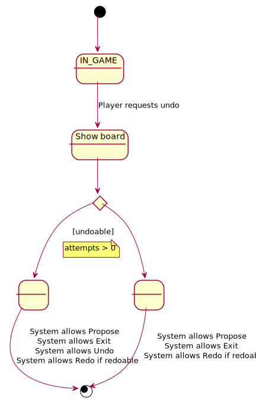  

## Vista de Caso de Uso Redo
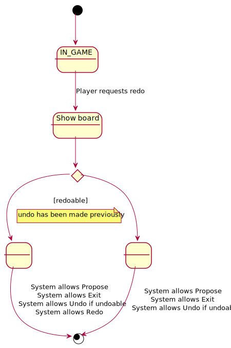  

## Vista de Caso de Uso Exit
  

## Vista de Caso de Uso Save
  

## Vista de Caso de Uso Resume
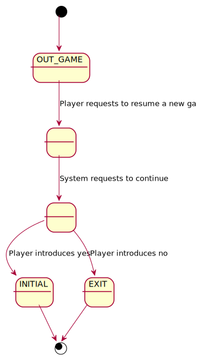

## Vista de Caso de Uso incluido ShowBoard


### Prototipo de Interfaz  

```
----- MASTERMIND ---------
Choose one option ----
1. Start a new game
2. Open a saved game
1
0 attempt(s):
----- Choose one option ----
1. Propose Combination
2. Exit game
1
Propose a combination: rybc
1 attempt(s):
rybc --> 0 blacks and 3 whites
----- Choose one option ----
1. Propose Combination
2. Undo previous Proposal
3. Exit game
3
Do you want to save the game?? (y/n): y
Name: game1
Do you want to continue? (y/n): y


----- MASTERMIND ---------
---- Choose one option ----
1. Start a new game
2. Open a saved game
2
----- Choose one option ----
1. game1.mm
1
game1.mm
1 attempt(s):
rybc --> 0 blacks and 3 whites
----- Choose one option ----
1. Propose Combination
2. Exit game
1
Propose a combination: mybc
2 attempt(s):
rybc --> 0 blacks and 3 whites
mybc --> 0 blacks and 3 whites
----- Choose one option ----
1. Propose Combination
2. Undo previous Proposal
3. Exit game
1
Propose a combination: rmbc
3 attempt(s):
rybc --> 0 blacks and 3 whites
mybc --> 0 blacks and 3 whites
rmbc --> 0 blacks and 3 whites
----- Choose one option ----
1. Propose Combination
2. Undo previous Proposal
3. Exit game
1
Propose a combination: rymc
4 attempt(s):
rybc --> 0 blacks and 3 whites
mybc --> 0 blacks and 3 whites
rmbc --> 0 blacks and 3 whites
rymc --> 0 blacks and 3 whites
----- Choose one option ----
1. Propose Combination
2. Undo previous Proposal
3. Exit game
1
Propose a combination: rybm
5 attempt(s):
rybc --> 0 blacks and 3 whites
mybc --> 0 blacks and 3 whites
rmbc --> 0 blacks and 3 whites
rymc --> 0 blacks and 3 whites
rybm --> 1 blacks and 3 whites
----- Choose one option ----
1. Propose Combination
2. Undo previous Proposal
3. Exit game
1
Propose a combination: brym
6 attempt(s):
rybc --> 0 blacks and 3 whites
mybc --> 0 blacks and 3 whites
rmbc --> 0 blacks and 3 whites
rymc --> 0 blacks and 3 whites
rybm --> 1 blacks and 3 whites
brym --> 1 blacks and 3 whites
----- Choose one option ----
1. Propose Combination
2. Undo previous Proposal
3. Exit game
1
Propose a combination: ybrm
7 attempt(s):
rybc --> 0 blacks and 3 whites
mybc --> 0 blacks and 3 whites
rmbc --> 0 blacks and 3 whites
rymc --> 0 blacks and 3 whites
rybm --> 1 blacks and 3 whites
brym --> 1 blacks and 3 whites
ybrm --> 4 blacks and 0 whites
You've won!!! ;-)
Do you want to save the game?? (y/n): n
Do you want to continue? (y/n):
```

## Analisis
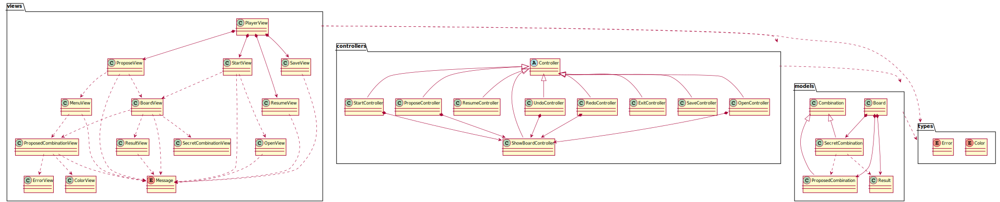

## Casos de Uso

### Analisis Start


### Analisis Open
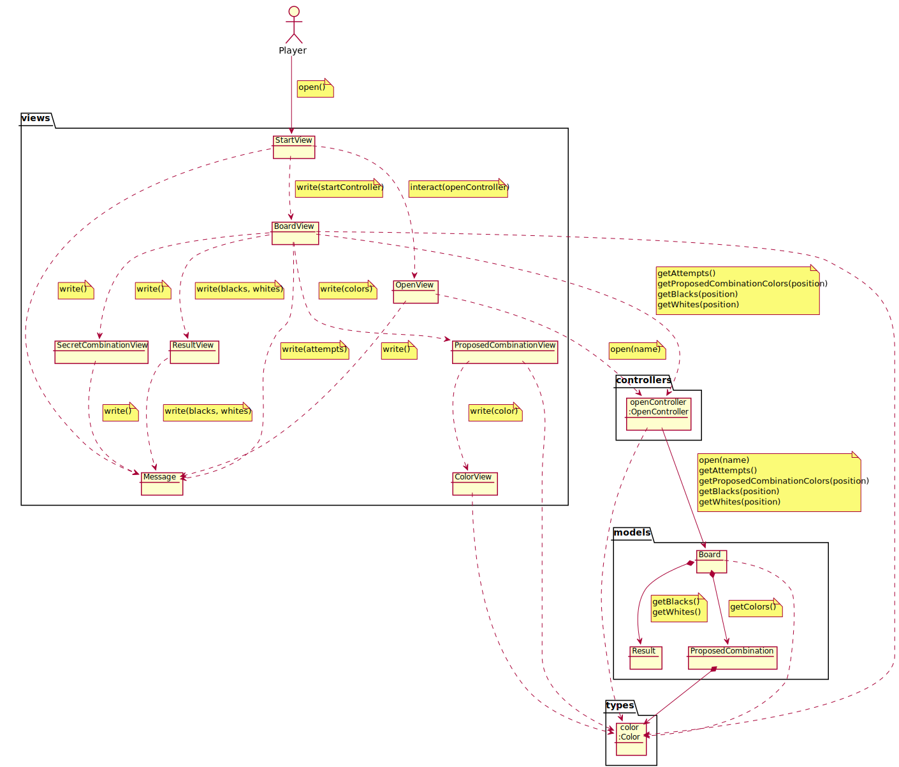

### Analisis Propose
  

### Analisis Undo
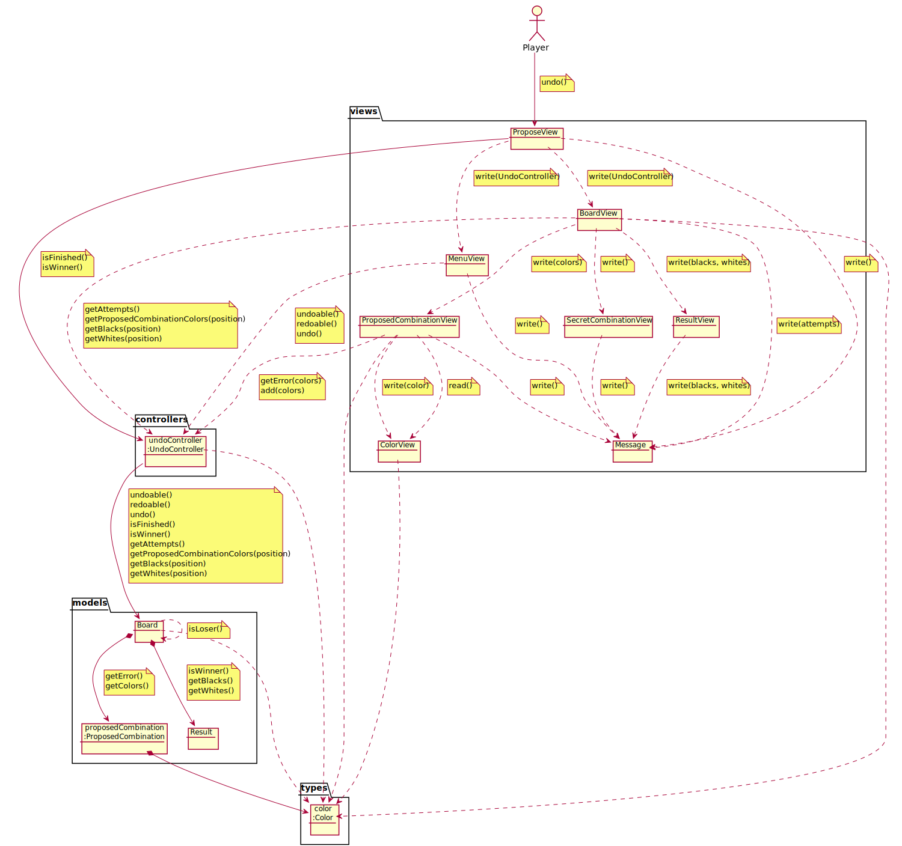  

### Analisis Redo
  

### Analisis Exit
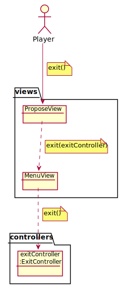

### Analisis Save


### Analisis Resume
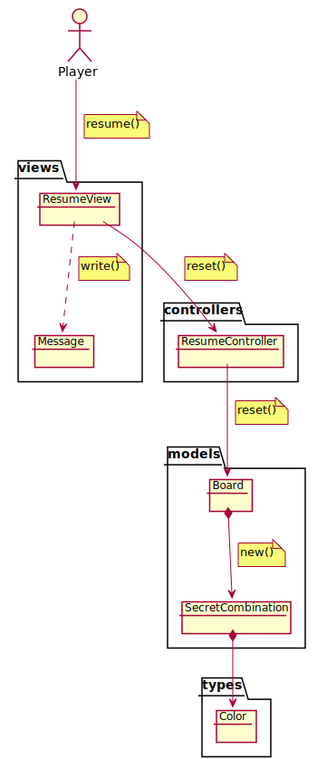

## Paquetes
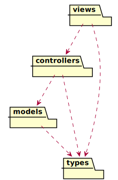

### Vistas
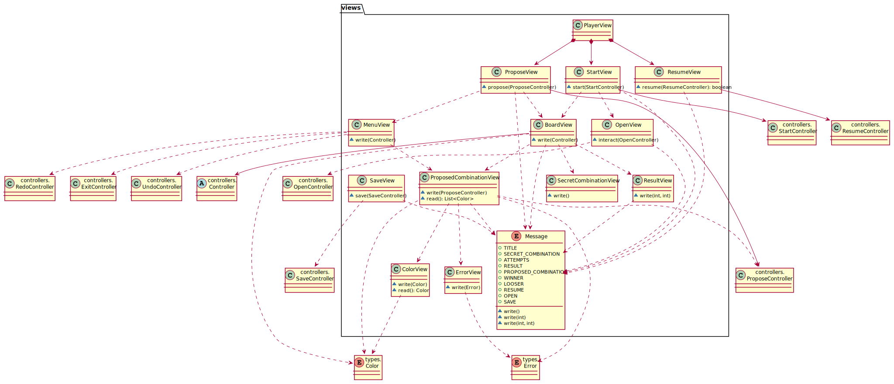

### Controladores
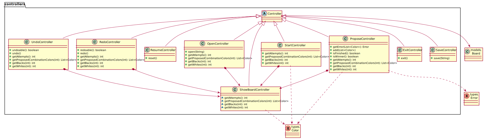

### Modelos
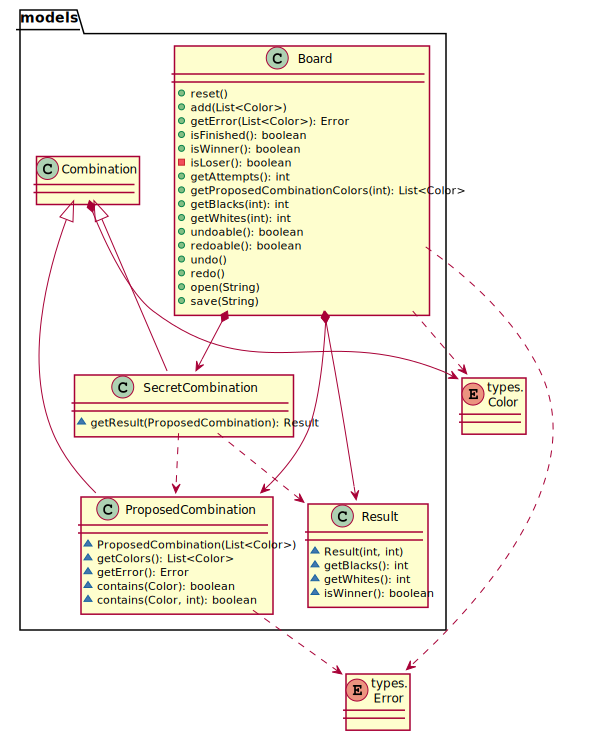

### Types
  

## Diseño  

### Vista de Despliegue  
<!--  -->

### Vista de Participantes  
  

### Vista de Interacción de Participantes  
  
